# Plan: Documentation Synchronization + Architecture Folder

## Discrepancies Found

1. **FOUND UNLISTED DISCREPANCY**: `documentation/fleet/components.md` line 253 claims `RentalBookingsList` data sources include `booking_contacts for email/phone`, but the actual code does NOT query `booking_contacts` — it only fetches `rental_bookings`, `booking_additional_info`, and `additional_info_categories`. Will update docs to match code.

2. **FOUND UNLISTED DISCREPANCY**: `documentation/analytics/data-flow.md` lines 51-53 say `task_type: 'pickup'` and `'dropoff'`, but the actual code uses `'delivery'` and `'return'`. Will fix in docs.

3. **FOUND UNLISTED DISCREPANCY**: `documentation/fleet/data-flow.md` section 2 step 6 claims `booking_contacts: Email and phone stored separately for privacy/querying` — prior to the recent Customer Information feature, this INSERT never actually happened (the code was missing). The docs described phantom behavior. Now the insert exists but with expanded fields. Will update.

4. **FOUND UNLISTED DISCREPANCY**: `documentation/analytics/components.md` line 211 says BarChart uses "Sampling: For month view with >15 days, shows every 3rd day" — this sampling was removed in the recent chart bug fixes. Will update.

## Files to Modify (6 existing)

### FILE 1: `/documentation/fleet/data-flow.md`
- Update Section 2 ASCII diagram: add customer info fields to "User enters:" block (email, phone, birth date, country, city)
- Update step 6 description: conditional INSERT into `booking_contacts` when any of email/phone/birth_date/city/country is filled; list all 8 columns written
- Add note that `customer_name` stays in `rental_bookings`
- Fix step numbering (booking_additional_info becomes step 7, booking_additional_costs step 8)

### FILE 2: `/documentation/fleet/components.md`
- Add "Customer Information" subsection under UnifiedBookingDialog describing the 6 fields, age computation, and 3 new components (InfoTooltip, CountryCombobox, CityCombobox)
- Fix RentalBookingsList data sources: remove `booking_contacts` claim, note it only fetches `rental_bookings` + `booking_additional_info` + `additional_info_categories`

### FILE 3: `/documentation/daily-program/data-flow.md`
- Update step 4: match wording from fleet/data-flow.md for booking_contacts conditional insert with all fields

### FILE 4: `/documentation/analytics/components.md`
- Add Secondary KPI Cards (Total Bookings, Avg Income/Booking, Avg Cost/Booking) + KpiCard component
- Add MarketingScatterPlot to hierarchy tree and describe it
- Update SummaryCard: left-border accents, real growth indicators
- Update BarChart/LineChart: granularity toggle, Card wrapper moved inside, toggle visibility rules
- Update IncomeBreakdown/ExpenseBreakdown: % of Total, Count, Growth columns replacing Top Month; 15-row limit + expansion dialog
- Fix task_type values in data-flow (pickup→delivery, dropoff→return)

### FILE 5: `/documentation/analytics/data-flow.md`
- Add period-over-period growth computation for SummaryCards
- Add granularity state flow for charts (local state, reset on timeframe change)
- Note customRange now respected for Custom timeframe
- Fix task_type values (pickup→delivery, dropoff→return)

### FILE 6: `/documentation/analytics/performance.md`
- Replace "Sampling for Dense Charts" section: remove old `data.filter` code, describe new approach (all data points kept, X-axis labels thinned via `interval` prop, formula documented)

## Files to Create (4 new in `/documentation/architecture/`)

### FILE A: `README.md`
- Intro paragraph + index of 3 files with one-line descriptions
- Note: written for readers without database experience

### FILE B: `database-overview.md`
- Section 1: Filing cabinet analogy (table = cabinet, row = folder, column = label)
- Section 2: Primary keys (UUIDs, uniqueness rule)
- Section 3: Foreign keys (pointer concept, single source of truth, example: rental_bookings.vehicle_id → vehicles.id)
- Section 4: Why this matters (no duplicated data)
- Section 5: ON DELETE CASCADE (verified from migrations: CASCADE on vehicle_maintenance, vehicle_reminders, rental_bookings→vehicles, booking_contacts→rental_bookings, etc.; SET NULL on financial_records→vehicles/bookings, damage_reports→bookings)
- Section 6: RLS explanation (database-level enforcement, auth.uid() = user_id)

### FILE C: `data-relationships.md`
- Section 1: Full ER diagram (Mermaid + ASCII) showing all tables and FK connections verified from migrations
- Section 2: Three focused diagrams (Booking ecosystem, Vehicle ecosystem, Financial ecosystem) — each in Mermaid + ASCII
- Section 3: Glossary of terms

Sample Mermaid for the full ER diagram:

```mermaid
erDiagram
    auth_users ||--o| profiles : "user_id"
    auth_users ||--o| user_roles : "user_id"
    auth_users ||--o{ vehicles : "user_id"
    vehicles ||--o{ rental_bookings : "vehicle_id CASCADE"
    vehicles ||--o{ vehicle_maintenance : "vehicle_id CASCADE"
    vehicles ||--o{ vehicle_reminders : "vehicle_id CASCADE"
    vehicles ||--o{ damage_reports : "vehicle_id CASCADE"
    vehicles ||--o{ vehicle_documents : "vehicle_id CASCADE"
    vehicles ||--o{ vehicle_images : "vehicle_id CASCADE"
    vehicles ||--o| camper_features : "vehicle_id CASCADE"
    vehicles ||--o{ maintenance_blocks : "vehicle_id CASCADE"
    vehicles ||--o{ financial_records : "vehicle_id SET NULL"
    vehicles ||--o{ recurring_transactions : "vehicle_id SET NULL"
    vehicles ||--o{ price_season_rules : "vehicle_id CASCADE"
    rental_bookings ||--o| booking_contacts : "booking_id CASCADE"
    rental_bookings ||--o{ booking_additional_info : "booking_id CASCADE"
    rental_bookings ||--o{ booking_additional_costs : "booking_id CASCADE"
    rental_bookings ||--o{ financial_records : "booking_id SET NULL"
    rental_bookings ||--o{ damage_reports : "booking_id SET NULL"
    price_seasons ||--o{ price_season_rules : "season_id CASCADE"
    additional_info_categories ||--o{ booking_additional_info : "category_id CASCADE"
    additional_cost_categories ||--o{ booking_additional_costs : "category_id SET NULL"
    user_asset_categories ||--o{ user_assets : "category_id CASCADE"
    ai_chat_conversations ||--o{ ai_chat_messages : "conversation_id CASCADE"
    user_reminders }o--o| vehicles : "vehicle_id SET NULL"
```

### FILE D: `crm-roadmap.md`
- Section 1: Current state (booking_contacts 1-to-1 with rental_bookings, all columns listed, customer_name in rental_bookings)
- Section 2: Future state (planned customers table, customer_id FK on rental_bookings, Mermaid + ASCII diagram)
- Section 3: Migration path (4-step process: create table, group by name+email, add FK, populate)
- Section 4: Security posture (current AES-256/TLS/RLS, planned pgcrypto/WAF/audit/GDPR)

## Clarifications

No questions — all source files have been read and verified. The 10 files (6 updates + 4 creates) are the complete scope. No code files will be touched.

