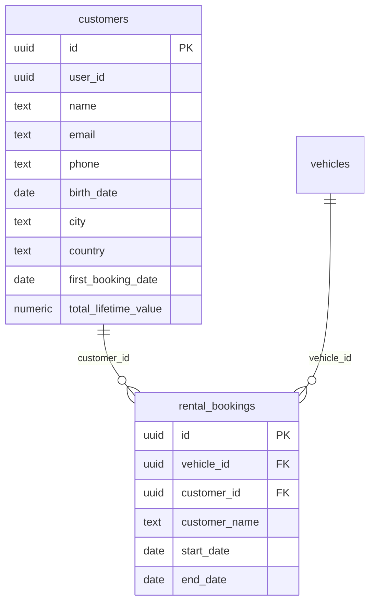

# CRM Roadmap — From Booking Contacts to Customer Management

This document describes the current customer data architecture, the planned CRM system, and the migration path between them.

---

## 1. Current State (Phase 1)

FlitX currently stores customer contact and profile data in the `booking_contacts` table, linked **1-to-1** with `rental_bookings` via `booking_id`.

### Current `booking_contacts` Columns

| Column | Type | Description |
|---|---|---|
| `id` | UUID (PK) | Unique row identifier |
| `booking_id` | UUID (FK → rental_bookings) | Links to the parent booking |
| `user_id` | UUID | The fleet operator who owns this data |
| `customer_email` | TEXT, nullable | Customer's email address |
| `customer_phone` | TEXT, nullable | Customer's phone number |
| `customer_birth_date` | DATE, nullable | Customer's date of birth |
| `customer_city` | TEXT, nullable | Customer's city of residence |
| `customer_country` | TEXT, nullable | Customer's country of residence |
| `customer_country_code` | TEXT, nullable | ISO country code (e.g., "GR", "DE") |
| `created_at` | TIMESTAMP | When the record was created |
| `updated_at` | TIMESTAMP | When the record was last modified |

### Where Customer Name Lives

**Important:** `customer_name` is NOT in `booking_contacts`. It lives in `rental_bookings.customer_name` as a required field. This is a historical artifact — the name was part of the original booking schema before the contact info was separated for PII security.

### The Problem

If the same customer (e.g., "John Smith, john@example.com") books three times, there are **three separate** `booking_contacts` rows — potentially with slightly different data:

| Booking | Email | Phone | City |
|---|---|---|---|
| Booking 1 | john@example.com | +30 123 456 | Athens |
| Booking 2 | john@example.com | +30 123 456 | Athens |
| Booking 3 | j.smith@gmail.com | — | Thessaloniki |

There is **no unified customer identity**. The system cannot answer questions like:
- "How many times has this customer booked?"
- "What is this customer's lifetime value?"
- "Which customers are repeat visitors?"

---

## 2. Future State (Phase 2 — CRM)

### Planned `customers` Table

| Column | Type | Description |
|---|---|---|
| `id` | UUID (PK) | Unique customer identifier |
| `user_id` | UUID | The fleet operator who owns this customer |
| `name` | TEXT | Customer's full name |
| `email` | TEXT, nullable | Primary email address |
| `phone` | TEXT, nullable | Primary phone number |
| `birth_date` | DATE, nullable | Date of birth |
| `city` | TEXT, nullable | City of residence |
| `country` | TEXT, nullable | Country of residence |
| `country_code` | TEXT, nullable | ISO country code |
| `first_booking_date` | DATE, nullable | Date of their first booking |
| `total_lifetime_value` | NUMERIC | Sum of all booking amounts |
| `created_at` | TIMESTAMP | When the customer record was created |
| `updated_at` | TIMESTAMP | When the customer record was last modified |

### Planned Relationship Change

A new `customer_id` foreign key will be added to `rental_bookings`, creating a **many-to-one** relationship: many bookings can belong to one customer.

### Mermaid Diagram



### ASCII Fallback

```
┌──────────────────┐          ┌─────────────────────┐          ┌──────────┐
│    customers     │          │   rental_bookings   │          │ vehicles │
├──────────────────┤          ├─────────────────────┤          ├──────────┤
│ id (PK)          │◄─────────│ customer_id (FK)    │          │ id (PK)  │
│ user_id          │  1:many  │ vehicle_id (FK)     │─────────►│ make     │
│ name             │          │ customer_name       │  many:1  │ model    │
│ email            │          │ start_date          │          │ year     │
│ phone            │          │ end_date            │          │ ...      │
│ birth_date       │          │ total_amount        │          └──────────┘
│ city             │          │ ...                 │
│ country          │          └─────────────────────┘
│ first_booking_date│
│ total_lifetime_value│
└──────────────────┘
```

### What This Unlocks

- **Lifetime value calculations** — Total revenue per customer across all bookings
- **Customer filtering** — Search and segment customers by location, booking frequency, or value
- **Loyalty detection** — Identify repeat customers automatically
- **AI-driven customer insights** — The AI assistant can answer "Who are my top 10 customers?" or "Which customers haven't booked in 6 months?"
- **Marketing segmentation** — Target specific customer groups with promotions
- **Booking pre-fill** — When creating a new booking, select an existing customer and auto-fill their details

---

## 3. Migration Path

Phase 1 data will be lifted into Phase 2 without data loss:

### Step 1: Create the `customers` table

```sql
CREATE TABLE public.customers (
  id UUID PRIMARY KEY DEFAULT gen_random_uuid(),
  user_id UUID NOT NULL,
  name TEXT NOT NULL,
  email TEXT,
  phone TEXT,
  birth_date DATE,
  city TEXT,
  country TEXT,
  country_code TEXT,
  first_booking_date DATE,
  total_lifetime_value NUMERIC DEFAULT 0,
  created_at TIMESTAMPTZ DEFAULT now(),
  updated_at TIMESTAMPTZ DEFAULT now()
);

ALTER TABLE public.customers ENABLE ROW LEVEL SECURITY;
```

### Step 2: Group existing data into unique customers

A migration script will:
1. Read all `booking_contacts` rows joined with `rental_bookings` (to get `customer_name`)
2. Group by a matching key: `(LOWER(customer_name), LOWER(customer_email))` where email exists, or `LOWER(customer_name)` alone where email is null
3. For each unique group, create one `customers` row using the most recent data (latest email, phone, city, etc.)
4. Calculate `first_booking_date` from the earliest booking in the group
5. Calculate `total_lifetime_value` from the sum of `rental_bookings.total_amount` in the group

### Step 3: Add `customer_id` column to `rental_bookings`

```sql
ALTER TABLE public.rental_bookings
  ADD COLUMN customer_id UUID REFERENCES public.customers(id) ON DELETE SET NULL;
```

### Step 4: Populate `customer_id` on historical bookings

Using the mapping from Step 2, update every existing `rental_bookings` row with its corresponding `customer_id`.

### Migration Notes

- This migration can run as a single Supabase migration file at the time of CRM launch
- The `customer_name` column on `rental_bookings` will be kept for backward compatibility (it's a required field used throughout the UI)
- The current Phase 1 data model is intentionally designed to make this migration painless — customer data is already stored in a structured, CRM-shaped form in `booking_contacts`

---

## 4. Security Posture

### Current Protection (Phase 1)

The `booking_contacts` table contains **Personally Identifiable Information (PII)** — specifically email, phone, birth date, city, and country.

Current protection layers:
1. **AES-256 encryption at rest** — All data stored on disk is encrypted (Supabase default)
2. **TLS encryption in transit** — All data transmitted between the app and database is encrypted (Supabase default)
3. **Row-Level Security (RLS)** — Strict policies ensure `user_id = auth.uid()`, so users can only access their own customer data

### Planned Additions (Phase 2)

The future CRM migration will add:
- **Column-level encryption** via `pgcrypto` for `customer_email` and `customer_phone` — these fields will be encrypted individually, so even database administrators cannot read them without the decryption key
- **Cloudflare WAF** — Network-level protection against SQL injection, XSS, and other web attacks
- **Audit logging** — Every access to PII columns will be logged with timestamp, user ID, and action type
- **GDPR-compliant data retention policies** — Automated deletion of customer data after configurable retention periods, with customer data export capabilities

See the migration-plan.html file for the full post-migration security roadmap.
