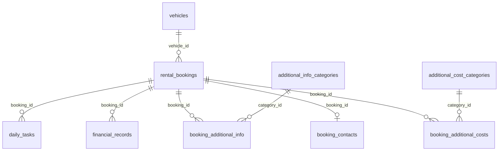
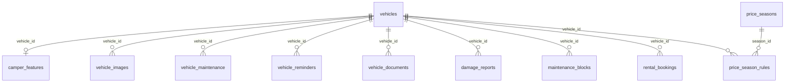
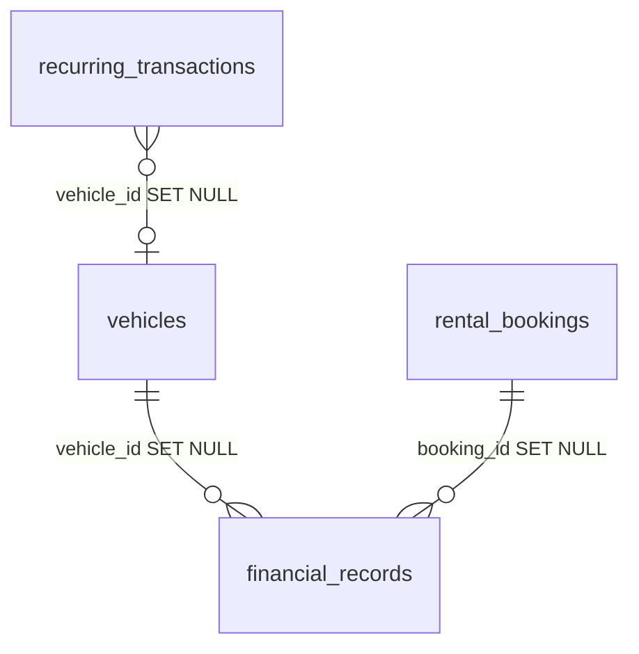

# Data Relationships — Table Connection Diagrams

This document provides visual diagrams showing how every table in the FlitX database connects to every other table via foreign keys.

---

## 1. The Big Picture

### Mermaid ER Diagram

```mermaid
erDiagram
    auth_users ||--o| profiles : "user_id"
    auth_users ||--o| user_roles : "user_id"

    vehicles ||--o{ rental_bookings : "vehicle_id CASCADE"
    vehicles ||--o{ vehicle_maintenance : "vehicle_id CASCADE"
    vehicles ||--o{ vehicle_reminders : "vehicle_id CASCADE"
    vehicles ||--o{ vehicle_documents : "vehicle_id CASCADE"
    vehicles ||--o{ vehicle_images : "vehicle_id CASCADE"
    vehicles ||--o| camper_features : "vehicle_id CASCADE"
    vehicles ||--o{ maintenance_blocks : "vehicle_id CASCADE"
    vehicles ||--o{ damage_reports : "vehicle_id CASCADE"
    vehicles ||--o{ financial_records : "vehicle_id SET NULL"
    vehicles ||--o{ recurring_transactions : "vehicle_id SET NULL"
    vehicles ||--o{ price_season_rules : "vehicle_id CASCADE"

    rental_bookings ||--o| booking_contacts : "booking_id CASCADE"
    rental_bookings ||--o{ booking_additional_info : "booking_id CASCADE"
    rental_bookings ||--o{ booking_additional_costs : "booking_id CASCADE"
    rental_bookings ||--o{ financial_records : "booking_id SET NULL"
    rental_bookings ||--o{ daily_tasks : "booking_id CASCADE"
    rental_bookings ||--o{ damage_reports : "booking_id SET NULL"

    price_seasons ||--o{ price_season_rules : "season_id CASCADE"

    additional_info_categories ||--o{ booking_additional_info : "category_id CASCADE"
    additional_cost_categories ||--o{ booking_additional_costs : "category_id SET NULL"

    user_asset_categories ||--o{ user_assets : "category_id CASCADE"

    ai_chat_conversations ||--o{ ai_chat_messages : "conversation_id CASCADE"

    user_reminders }o--o| vehicles : "vehicle_id SET NULL"
```



### ASCII Fallback

```
                              ┌──────────────┐
                              │  auth.users  │
                              └──────┬───────┘
                         ┌───────────┴───────────┐
                         │                       │
                    ┌────▼─────┐           ┌─────▼──────┐
                    │ profiles │           │ user_roles  │
                    └──────────┘           └────────────┘

┌───────────────────────────────────────────────────────────────┐
│                         VEHICLES                              │
│                      (central hub)                            │
└───┬───┬───┬───┬───┬───┬───┬───┬───┬───┬───────────────────────┘
    │   │   │   │   │   │   │   │   │   │
    │   │   │   │   │   │   │   │   │   └──► price_season_rules ◄── price_seasons
    │   │   │   │   │   │   │   │   └──► recurring_transactions (SET NULL)
    │   │   │   │   │   │   │   └──► financial_records (SET NULL) ◄── rental_bookings (SET NULL)
    │   │   │   │   │   │   └──► damage_reports (CASCADE)  ◄── rental_bookings (SET NULL)
    │   │   │   │   │   └──► maintenance_blocks (CASCADE)
    │   │   │   │   └──► camper_features (CASCADE, 1:1)
    │   │   │   └──► vehicle_images (CASCADE)
    │   │   └──► vehicle_documents (CASCADE)
    │   └──► vehicle_reminders (CASCADE)
    └──► vehicle_maintenance (CASCADE)

┌───────────────────────────────────────────────────────────────┐
│                     RENTAL_BOOKINGS                            │
│                  (booking hub)                                │
└───┬───┬───┬───┬───────────────────────────────────────────────┘
    │   │   │   │
    │   │   │   └──► daily_tasks (CASCADE)
    │   │   └──► booking_additional_costs (CASCADE) ◄── additional_cost_categories (SET NULL)
    │   └──► booking_additional_info (CASCADE) ◄── additional_info_categories (CASCADE)
    └──► booking_contacts (CASCADE, 1:1)

┌───────────────────────────────────────────────────┐
│              STANDALONE TABLES                     │
├───────────────────────────────────────────────────┤
│ user_notes          (user_id only, no FKs)        │
│ ai_chat_usage       (user_id only, no FKs)        │
│ insurance_types     (user_id only, no FKs)        │
│ user_reminders      (optional vehicle_id SET NULL) │
│                                                   │
│ ai_chat_conversations ──► ai_chat_messages        │
│ user_asset_categories ──► user_assets             │
└───────────────────────────────────────────────────┘
```

---

## 2. Focused Diagrams

### 2a. Booking Creation Ecosystem



```
                    ┌──────────┐
                    │ vehicles │
                    └────┬─────┘
                         │ vehicle_id
                ┌────────▼────────┐
                │ rental_bookings │
                └──┬──┬──┬──┬──┬─┘
                   │  │  │  │  │
    ┌──────────────┘  │  │  │  └──────────────────┐
    │                 │  │  │                      │
    ▼                 ▼  │  ▼                      ▼
booking_contacts  booking_│ financial_records  daily_tasks
                  additional_info
                  additional_costs
                     │  │
                     ▼  ▼
              additional_info_categories
              additional_cost_categories
```

### 2b. Vehicle Ecosystem



```
                         ┌──────────┐
                         │ vehicles │
                         └──┬───────┘
     ┌──────┬──────┬────┬───┴───┬──────┬──────┬──────┬─────┐
     │      │      │    │       │      │      │      │     │
     ▼      ▼      ▼    ▼       ▼      ▼      ▼      ▼     ▼
  camper  vehicle vehicle vehicle  damage maint  rental  price   maint
  features images  maint  remind   reports blocks bookings season  blocks
  (1:1)                  ers                      rules
                                                    ▲
                                                    │ season_id
                                              price_seasons
```

### 2c. Financial Ecosystem



```
┌──────────┐                    ┌─────────────────┐
│ vehicles │──vehicle_id───────►│                 │
└──────────┘   (SET NULL)       │ financial_      │
                                │ records         │
┌──────────────────┐            │                 │
│ rental_bookings  │──booking_id►                 │
└──────────────────┘ (SET NULL) └─────────────────┘

┌──────────────────────────┐
│ recurring_transactions   │──vehicle_id──► vehicles (SET NULL)
│ (generates financial_    │
│  records via edge fn)    │
└──────────────────────────┘
```

---

## 3. Glossary

| Term | Plain-English Definition |
|---|---|
| **Primary Key** | A unique identifier for each row in a table. No two rows share the same primary key. In FlitX, these are UUIDs (long random strings). |
| **Foreign Key** | A column in one table that stores the primary key of a row in another table. It's a pointer: "this row is connected to that row." |
| **JOIN** | A database operation that combines rows from two tables based on a foreign key match. For example, joining `rental_bookings` with `vehicles` to get the vehicle name for each booking. |
| **CASCADE** | A delete rule: when a parent row is deleted, all child rows pointing to it are automatically deleted too. |
| **SET NULL** | A delete rule: when a parent row is deleted, child rows are kept but their foreign key column is set to NULL (empty). |
| **NULL** | An empty value — the absence of data. Not the same as zero or blank text. |
| **Nullable** | A column that is allowed to contain NULL values. Non-nullable columns must always have a value. |
| **Row** | A single record in a table (e.g., one vehicle, one booking). |
| **Column** | A named field in a table (e.g., "make", "model", "year"). All rows in the same table have the same columns. |
| **Table** | A structured collection of rows and columns, like a spreadsheet sheet. Each table stores one type of data. |
| **ON DELETE CASCADE** | The SQL rule that enables cascade behavior. Written as part of the foreign key definition when creating a table. |
